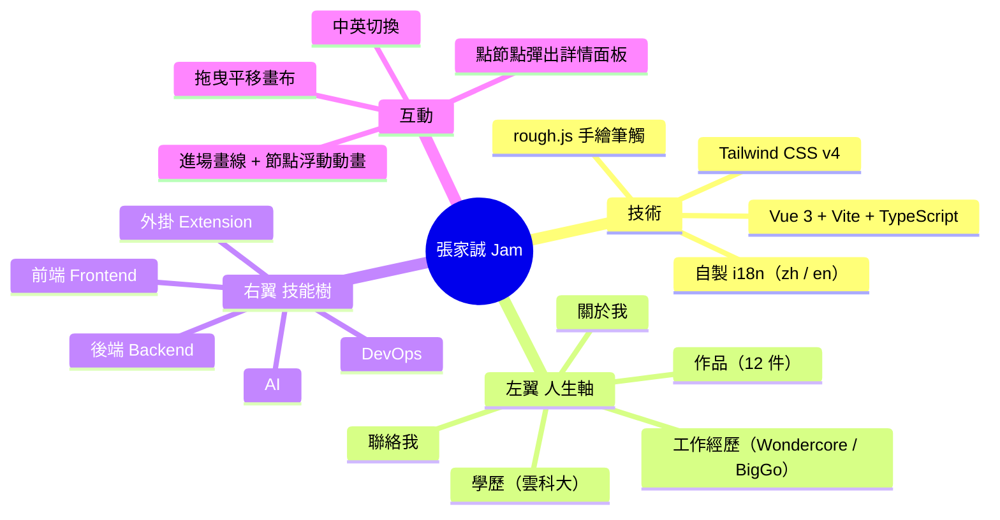

# jam-website-vue 規劃文件

這份文件說明 Jam 的個人網站設計：一個 **手繪風格的互動心智圖（mind map）**，以 **Vue 3 + Tailwind CSS + rough.js** 開發的純前端 SPA，不做 SEO。畫面以 Jam 為中心節點、向左右延伸出人生軸與技能樹分支，點擊任一節點會彈出豐富的詳情面板。內容自舊站 [jam-website-nuxt](../jam-website-nuxt) 完整移植（工作經歷、學歷、技能、作品）。配色沿用舊站的深藍主色，但整體改走溫暖紙感、手繪塗鴉的自由風格。透過 GitHub Actions 部署到 GitHub Pages。

## 架構概覽



## 目標與非目標

**目標**
- 單一畫面呈現的互動心智圖，Jam 為中心、分支為技能與經歷。
- 手繪、溫暖、有個人風格的視覺（放棄先前的極簡風）。
- 內容豐富：工作經歷成就、學歷、六大技能領域含 logo、作品集含截圖。
- 中英文可切換。
- 推送到 `main` 後自動部署到 GitHub Pages。

**非目標**
- 不做 SEO（無 meta/OG、sitemap、prerender）。
- 不做多頁路由、CMS、後端 API。

## 技術選型

| 項目 | 選擇 | 理由 |
|---|---|---|
| 框架 | Vue 3 + `<script setup>` + TypeScript | 純 SPA，Vite 建置快、設定單純 |
| 樣式 | Tailwind CSS v4（`@theme` token） | 快速控制版型與色彩，色票集中管理 |
| 手繪筆觸 | [rough.js](https://roughjs.com/) | 產生 excalidraw 般的素描感連線、頭像圈、節點邊框，是「手繪」風格的關鍵 |
| 字體 | Caveat（拉丁手寫）+ Nunito / PingFang TC（內文） | 手寫字給拉丁標題與副標；中文用圓潤無襯線維持親和且輕量 |
| i18n | 自製 `useLocale()` + `zh.ts` / `en.ts` | 兩語言、內容量可控，不需 vue-i18n |
| 路由 | 不使用 | 單頁，靠節點與面板切換 |

## 視覺設計

沿用舊站 [assets/public.scss](../jam-website-nuxt/assets/public.scss) 的深藍主色，另擴充一組和諧的分支色，全部定義在 [src/assets/main.css](src/assets/main.css) 的 `@theme`，hex 版本另存於 [src/theme.ts](src/theme.ts) 供 rough.js 使用。

| 用途 | 色碼 |
|---|---|
| 紙感背景 | `#f6f1e7` |
| 主要文字（ink） | `#26323d` |
| 關於我 / 中心（navy） | `#35597f` |
| 前端 frontend | `#2f8f83` |
| 後端 backend | `#c77b34` |
| AI | `#8a5cc0` |
| DevOps | `#4e7cc9` |
| 外掛 extension | `#c25b6e` |
| 工作經歷 career | `#b5502e` |
| 學歷 education | `#5c9a46` |
| 作品 projects | `#cf9a2b` |
| 聯絡 contact | `#4a6572` |

**風格重點**：溫暖紙感背景（漸層 + 點陣紋理）、rough.js 素描連線與邊框、節點如便利貼般帶輕微傾斜、emoji 圖示、拉丁手寫副標；動畫包含進場「畫線」、節點持續浮動、hover 放大、面板彈入。

## 內容結構

每個節點以 `label / sub / emoji / color / side / content` 描述，`content` 為以下型別之一（見 [src/locales/types.ts](src/locales/types.ts)）：

- `about` — 段落 + highlight chips
- `skill` — 說明文字 + 技能項目（含 logo）
- `career` / `education` — 多筆條目（單位、職稱/學位、期間、地點、成就清單）
- `projects` — 作品卡片（截圖、說明、標籤、連結）
- `links` — 聯絡連結

文案在 [src/locales/zh.ts](src/locales/zh.ts) / [en.ts](src/locales/en.ts)，圖片素材放在 [public/logos/](public/logos/) 與 [public/projects/](public/projects/)。

## 專案結構

```
src/
├── App.vue                     # LocaleSwitch + MindMap
├── components/
│   ├── MindMap.vue             # 畫布容器：縮放、拖曳平移、詳情狀態
│   ├── RoughConnectors.vue     # rough.js 素描連線 + 畫線動畫
│   ├── CenterNode.vue          # 中心：頭像 + 手繪圈 + 姓名
│   ├── BranchNode.vue          # 分支便利貼節點（浮動、hover）
│   ├── DetailPanel.vue         # 依內容型別渲染的豐富詳情面板
│   └── LocaleSwitch.vue        # 中英切換
├── composables/
│   ├── useLocale.ts            # 語言狀態
│   └── useGraphLayout.ts       # 左右翼節點座標與連線路徑
├── locales/ (types.ts, zh.ts, en.ts)
├── theme.ts                    # 分支色 hex + 資產路徑 helper
└── assets/main.css             # Tailwind + @theme token + 紙感背景
```

## CI/CD

GitHub 官方 Pages 流程（見 [.github/workflows/deploy.yml](.github/workflows/deploy.yml)）：push 到 `main` → `npm ci` → `npm run build`（`dist/`）→ `upload-pages-artifact` → `deploy-pages`。

- 網域：預設 `https://changjam.github.io/jam-website-vue/`。
- `vite.config.ts` 的 `base` 設為 `/jam-website-vue/`。
- 之後若要換自訂網域，再處理與 jam-website-nuxt 的網域衝突。

## 待確認事項

- **LinkedIn 連結**：目前為 `https://www.linkedin.com/` 佔位，待 Jam 提供實際個人頁網址。
- **作品取捨**：目前收錄 12 件，可再增減或調整排序。
