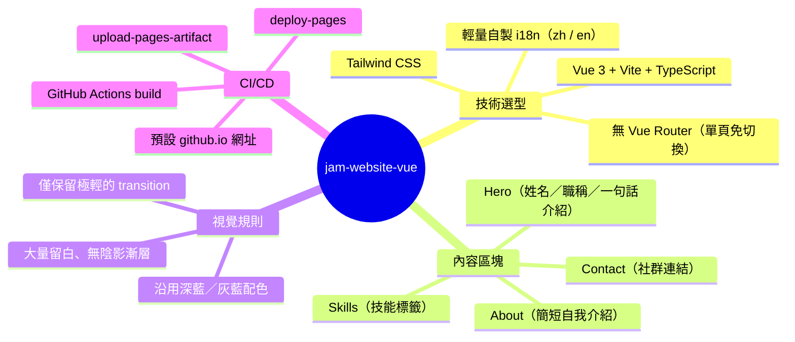

# jam-website-vue 規劃文件

這份文件規劃一個全新的個人一頁式介紹網站：以 **Vue 3 + Tailwind CSS** 開發成 SPA、不考慮 SEO，風格走簡潔留白、幾乎無動畫的路線，配色沿用現有 [jam-website-nuxt](../jam-website-nuxt) 的深藍／灰藍色調。完成後透過 GitHub Actions 部署到 GitHub Pages（預設 `github.io` 網址）。讀者是 Jam 本人，讀完可以確認技術選型、內容架構、視覺規則與 CI/CD 流程是否符合預期，核准後即可依此文件開始開發。

## 架構概覽



## 目標與非目標

**目標**
- 一頁式個人介紹，訪客滑一次就能看完。
- 視覺乾淨、留白充足，資訊密度低。
- 中英文可切換。
- 推送到 `main` 後自動建置並部署到 GitHub Pages。

**非目標**
- 不做 SEO（沒有 meta/OG 優化、sitemap、prerender）。
- 不做履歷式的條列經歷、時間軸。
- 不做多頁路由、CMS、後端 API。
- 不追求視覺特效或互動亮點（無 hover 浮動、無卡片翻轉等）。

## 技術選型

| 項目 | 選擇 | 理由 |
|---|---|---|
| 框架 | Vue 3 + `<script setup>` + TypeScript | 純 SPA 不需要 Nuxt 的 SSR/SEO 能力，Vite 建置快、設定單純 |
| 建置工具 | Vite | 官方推薦、GitHub Pages 靜態輸出天然契合 |
| 路由 | 不使用 Vue Router | 只有一頁，區塊用錨點捲動即可，減少依賴 |
| 樣式 | Tailwind CSS | Utility-first，容易控制留白／字級的一致性，且不必額外維護自訂 class 命名 |
| i18n | 自製 `useLocale()` composable + `zh.ts` / `en.ts` 字典 | 只有兩語言、內容量小，`vue-i18n` 對這規模是過重的依賴 |
| 套件管理 | npm（Node 20.x），與 jam-website-nuxt 一致 | 維持環境一致性 |
| 測試 | 不建立測試套件 | 靜態展示頁，複雜度不足以支撐測試投資 |
| Lint | ESLint（vue + typescript 基本規則，由 create-vue 內建） | 維持程式碼品質，但不引入額外風格框架 |

## 視覺設計規則

沿用 [assets/public.scss](../jam-website-nuxt/assets/public.scss) 的色調，但只取色彩，不沿用裝飾風格（漸層、陰影、卡片邊角裝飾都不搬過來），色彩會定義在 Tailwind 的 theme 中，元件直接用 Tailwind class（如 `bg-bg`、`text-ink`、`text-accent`）取用。

| Tailwind token | 色碼 | 用途 | 來源 |
|---|---|---|---|
| `bg` | `#FDFDFA` | 背景 | `$opposite-color` |
| `ink` | `#121E2A` | 主要文字 | `$primary-color` |
| `accent` | `#446c94` | 強調色（連結、標籤邊框） | `$secondary-color` |
| `accent-light` | `#b9d9fa` | 次要強調（極少量點綴） | `$light-blue` |

**設計約束**：
- 排版以垂直單欄為主，大量 `padding`/`margin`，行寬限制在易讀範圍（約 `max-w-2xl`）。
- 字體使用系統字體堆疊（`-apple-system, "PingFang TC", "Segoe UI", sans-serif`），不額外載入 Web Font，維持輕量與一致觀感。
- 不使用陰影、漸層、卡片浮起效果；元素之間用留白和一條細分隔線（`border-ink/10`）區分即可。
- 動畫僅保留必要的輕量過渡：語言切換的文字淡入淡出、頁面首次載入的淡入，時長 150–200ms（Tailwind `transition-opacity duration-150`），不做位移/縮放類的 hover 效果。
- 技能標籤為純靜態文字方塊，不做點擊互動（與 nuxt 版本的可點擊技能樹不同）。

## 內容規劃

一頁四個區塊，由上而下：

1. **Hero** — 姓名、職稱、一句話介紹（大留白置中或靠左）。
2. **About** — 1–2 段簡短自我介紹文字，不走履歷式條列。
3. **Skills** — 技能標籤（可比照 nuxt 版分類：前端／後端／AI／DevOps／Extension），純展示、無互動。
4. **Contact** — GitHub / LinkedIn / Gmail / IG 等連結，文字或極簡線性 icon，不用按鈕陰影。

文案內容（姓名、職稱、自介文字、技能清單、連結網址）由 Jam 後續提供或直接沿用 nuxt 版本 [locales/zh-tw.json](../jam-website-nuxt/locales/zh-tw.json) 整理精簡版，開發時先用 placeholder 撐版。

## 專案結構

```
jam-website-vue/
├── .github/workflows/deploy.yml   # CI/CD
├── public/
│   └── favicon 等靜態資源
├── src/
│   ├── main.ts
│   ├── App.vue                     # 組裝四個區塊
│   ├── components/
│   │   ├── Hero.vue
│   │   ├── About.vue
│   │   ├── Skills.vue
│   │   ├── Contact.vue
│   │   └── LocaleSwitch.vue
│   ├── composables/
│   │   └── useLocale.ts
│   ├── locales/
│   │   ├── zh.ts
│   │   └── en.ts
│   └── assets/main.css             # @import "tailwindcss" + theme tokens
├── index.html
├── vite.config.ts
├── tsconfig.json
├── package.json
└── README.md
```

## CI/CD 規劃

使用 GitHub 官方 Pages 部署流程（`actions/upload-pages-artifact` + `actions/deploy-pages`），不採用推送 `gh-pages` branch 的舊式做法。

流程（`.github/workflows/deploy.yml`）：

1. 觸發條件：push 到 `main`。
2. `actions/checkout` → `actions/setup-node`（Node 20）→ `npm ci` → `npm run build`（Vite 輸出到 `dist/`）。
3. `actions/upload-pages-artifact` 上傳 `dist/`。
4. `actions/deploy-pages` 部署。
5. Repo 設定 `Settings → Pages → Source` 改為 GitHub Actions。

**網域**：先用 GitHub 預設網域 `<username>.github.io/jam-website-vue`（暫不處理 `jamchang.com` 的網域衝突，之後要接自訂網域再回來調整）。因此：
- `vite.config.ts` 的 `base` 設為 `/jam-website-vue/`（對應 repo 名稱的子路徑）。
- 不需要 `CNAME` 檔案。

## Repo 規劃

- 由我建立 GitHub repo，名稱 `jam-website-vue`，**public**（private repo 在個人免費帳號下無法使用 GitHub Pages，且部署出去的網站本身仍是公開網址，改用 public 對個人作品集也沒有風險）。
- 本機路徑：`/Users/jam/Desktop/project/jam-website-vue`。

## 風險與待確認事項

- **內容文案**：Hero 一句話介紹、About 段落、Skills 標籤、Contact 連結網址目前尚未定案，開發時會先用 placeholder，待 Jam 提供或確認後再替換。
- **未來自訂網域**：目前先掛預設 `github.io` 網址，之後若要換成 `jamchang.com` 或其他網域，需要先處理與 jam-website-nuxt 的網域衝突（新舊站只能有一個用該網域）。

## 開發階段

核准本文件後，依序進行：

1. 建立 GitHub repo（public）並在本機初始化 Vite + Vue3 + TS + Tailwind 專案骨架。
2. 建立 `useLocale` 與 zh/en 字典，串接四個區塊元件與 placeholder 文案。
3. 用 Tailwind 套用色彩與留白版型，確認 RWD（手機／桌機）表現。
4. 撰寫 `.github/workflows/deploy.yml`，設定 Vite `base` 路徑。
5. 本機 `npm run build` 驗證輸出，推送 GitHub 後確認 Actions 部署成功、`github.io` 網址可正常訪問。
